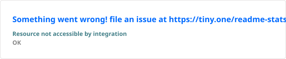

<p align="center">
  
</p>

<h3 align="center">
  Data Analyst • Data Engineer
</h3>

<p align="center">
  <em>Turning data into insights and building scalable data systems.</em>
</p>

<p align="center">
  <a href="https://www.linkedin.com/in/noureldeenmohammad">
    
  </a>
  
  <a href="mailto:nour.eldeen01928@gmail.com">
    
  </a>
  
  <a href="https://wa.me/qr/K3VNGQG53DG2P1">
    
  </a>
</p>

---

## Now

I'm a **Data Analyst with a software development background**, currently building my skills toward **Data Engineering and Big Data**.

My current focus is on understanding how data moves from raw sources to reliable, scalable systems — from databases and ETL pipelines to distributed processing, streaming, cloud platforms, and modern data tools.

I enjoy working with data, solving problems, learning new technologies, and turning what I learn into practical projects.

---

## Skills

## Skills

<p align="center">
  
  
  
  
  
  
</p>

<p align="center">
  
  
  
</p>

<p align="center">
  
  
  
  
</p>

<p align="center">
  
  
  
</p>

## Currently Learning — Data Engineering & Big Data

I'm currently following a structured Data Engineering & Big Data roadmap through hands-on training and multiple learning resources.

### Foundations

<p>


</p>

### Big Data Ecosystem

<p>


</p>

### Data Engineering

<p>


</p>

### Streaming

<p>


</p>

### Cloud & Modern Data Platforms

<p>


</p>

### Data Platform & Operations

<p>


</p>

### Modern Data Stack

<p>


</p>

### Data & Industry Trends

<p>


</p>

> **Learning status:** These technologies are part of my current learning roadmap. My hands-on experience with each technology is developing progressively through training and projects.

---

## Projects

<table>
  <tr>
    <td width="50%" valign="top">

### Sales Performance Analysis

**AdventureWorks2019**

**Tech Stack**


- Cleaned, joined, and prepared AdventureWorks2019 sales data using SQL.
- Created a unified reporting view for analysis.
- Performed data validation and exploratory analysis using Python.
- Prepared data for reporting using Power Query.
- Built a Power BI data model and developed DAX measures.
- Analyzed Sales, Profit, Orders, Customers, Profit Margin, and YoY Growth.
- Designed an interactive single-page dashboard with dynamic filtering and bookmark navigation.

</td>

<td width="50%" valign="top">

### Student Tracking System

**Web-Based Academic Management System**

**Tech Stack**


- Developed a web-based system for managing student records.
- Implemented attendance, grades, assignments, and academic performance management.
- Designed and managed the application database using SQL Server and Entity Framework.
- Built backend functionality using C# and ASP.NET Core MVC.
- Used Git/GitHub for version control.
- Used Docker for application containerization.

</td>
  </tr>
</table>

---

## Big Data Learning Journey

My current roadmap is focused on gradually moving from **Data Analytics → Data Engineering → Big Data**.

```text
Data Analytics
      │
      ├── Python
      ├── SQL
      ├── Data Cleaning
      ├── Data Analysis
      └── Power BI
            │
            ▼
Data Engineering Foundations
      │
      ├── Linux
      ├── Git/GitHub
      ├── Docker
      ├── ETL / ELT
      ├── Data Modeling
      └── Data Warehousing
            │
            ▼
Big Data
      │
      ├── Hadoop
      ├── Spark
      ├── Hive
      ├── Kafka
      ├── Spark Streaming
      └── Flink
            │
            ▼
Cloud & Modern Data Platforms
      │
      ├── AWS
      ├── Azure
      ├── Databricks
      └── Snowflake
            │
            ▼
Modern Data Engineering
      │
      ├── dbt
      ├── Airbyte
      ├── Fivetran
      ├── DataOps
      ├── MLOps
      └── Monitoring
```

---

## Training & Education

### Data Engineering & Big Data
**Ongoing — 2026**

Currently building foundational and practical knowledge in:

- Data Engineering
- Big Data
- Distributed Data Processing
- Data Pipelines
- Data Warehousing
- Streaming
- Cloud Technologies

---

### Data Analytics Specialist — DEPI / MCIT
**Nov 2025 – Jul 2026**

- Python
- SQL
- Data Preparation
- Data Cleaning
- Data Analysis
- Power BI
- Tableau
- End-to-end Data Analytics Project
- AdventureWorks2019

---

### Full Stack .NET Web Developer — DEPI / MCIT
**Oct 2024 – May 2025**

- C#
- ASP.NET Core MVC
- SQL Server
- Database Design
- REST APIs
- Git/GitHub
- Docker
- Student Tracking System

---

## Education

### Bachelor of Engineering in Electrical and Computer Engineering

**Kafrelsheikh University — Egypt**

**2021 – 2026**

Relevant Coursework:

- Databases
- Data Structures & Algorithms
- Operating Systems
- Software Development

---

## Highlights

| Area | Details |
|---|---|
| **Data Analytics** | Python, SQL, Power BI, Tableau, Excel, Power Query & DAX |
| **Data Engineering Path** | Currently studying Data Engineering & Big Data |
| **Big Data** | Learning Hadoop, Spark, Hive, Kafka, Flink & distributed processing |
| **Cloud** | Currently learning AWS, Azure & Databricks |
| **Modern Data Stack** | Learning dbt, Airbyte, Fivetran & Snowflake |
| **Software Development** | C#, .NET, ASP.NET Core MVC & REST APIs |
| **Databases** | SQL Server, Database Design & Data Modeling |
| **Dev Tools** | Linux, Git, GitHub & Docker |

---

## GitHub Stats

<p align="center">
  

  
</p>

<p align="center">
  
</p>

---

## What I'm Working Toward

My long-term goal is to grow from a **Data Analyst** into a **Data Engineer**, with a strong foundation in:

- Building reliable data pipelines
- Designing scalable data systems
- Distributed data processing
- Batch and streaming systems
- Data warehousing
- Cloud data platforms
- Modern data engineering tools

I'm documenting my learning journey through projects, experiments, and practical implementations.
